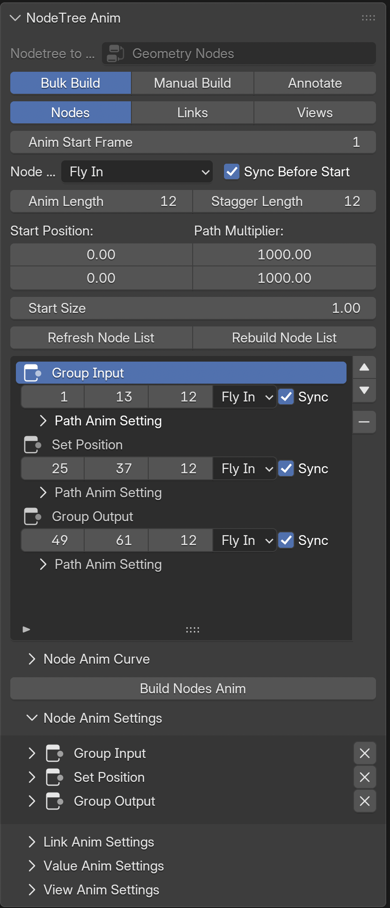
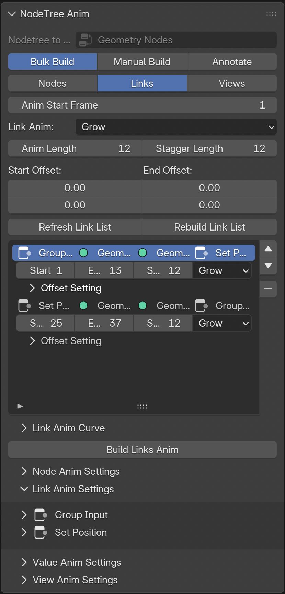
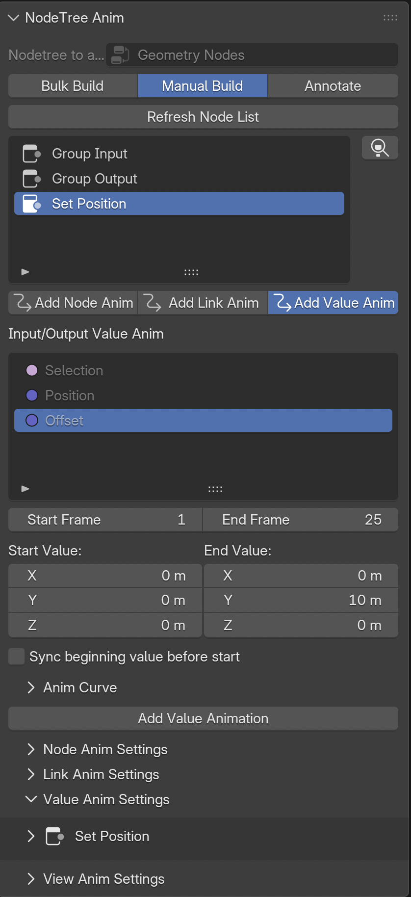
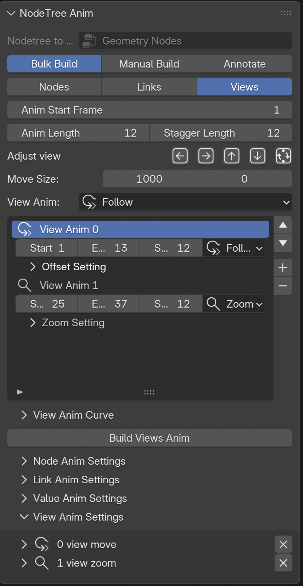
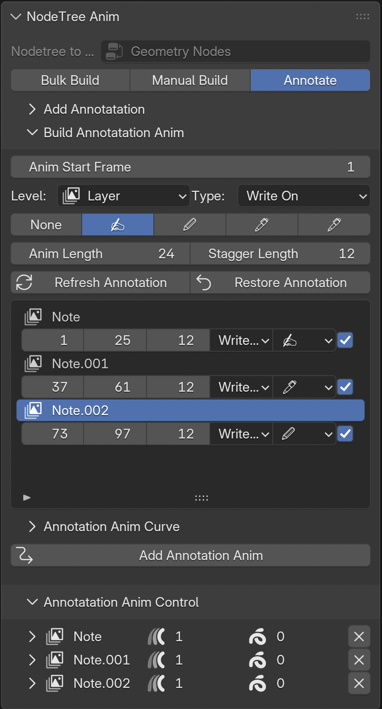

# Blender Node Tree Animation Builder 

This tool is for creating fancy node tree animation for blender node tree systems, you can use it to create 
animation for shader nodes, geometry nodes, compositor nodes, etc. It is a powerful tool that can help you 
create complex animation for your node tree explainary tutorials.

## Features
- Supporting all node tree types, including **shader nodes**, **geometry nodes**, **compositor nodes**, **texture nodes**.
- Support for creating animation for **nodes**, **links**, **values**, **views** and even **annotations**.
- Live update animation parameters.
- Anim Curve editor for creating complex animation curves.

## Installation
- `Edit -> Preference -> Get Extensions -> Install from Disk...`, locate the zip file to install.

## Usage
Go to any `tree editor` space (Geometry Node Editor, Compositor, Shader Editor, Texture Node Editor), `N` panel to 
open the `Nodetree Anim` panel in the node worksapce to build the wanted animations.

| Node Anim Buildup | Link Anim Buildup | Value Anim Buildup | View Anim Buildup | Annotation Anim Buildup |
|---------|---------|---------|---------|---------|
|  |  |  |  |  |

You can animate `Nodes`, `Links`, `Values`, `Views` and `Annotations`. You can build the animations in `Bulk` for 
`Nodes`, `Links` and `Views` or one by one in `Manual` for `Nodes`, `Links` and `Values`. 
`Annotation` animation in its own category.
1. Bulk Build
    - The options above the list window are global controls, their value will control all items in the list.
        - The `Anim Start Frame` is an exceptional one, it only affects the first item's start value.
    - You can control individual behavior in the list.
2. Manual Build
    - First select a `Node` in the node list, 
        - Adjust desired controls to build the node's animation.
        - For `Link` and `Value`, the available links and values of the selected node will show up in the list, select one to build its animation.
        - You can also add a new 'Link'.
2. Annotate
    - Add your annotation first, several quick tools, drawing, eraser, etc., are accessible for your convenience.
    - Once you have annotation, you can select and build the animation based on different levels, including `Layer`, `Frame` and `Stroke`.
    - A writing symbol can be added for writing effect animation.
    - Morph animation hasn't implemented yet.
    - You can `Restore Annotation` and start over your animation builds.

  
Detailed description of settings

  

  
Bulk Build

  <ul>
    <li>Item 1</li>
    <li>Item 2</li>
    <li>Item 3</li>
  </ul>
  

  

  
Manual Build

  <ul>
    <li>Item 1</li>
    <li>Item 2</li>
    <li>Item 3</li>
  </ul>
  

  

  
Annotate

  <ul>
    <li>Item 1</li>
    <li>Item 2</li>
    <li>Item 3</li>
  </ul>
  

Once the animation added, some controls will show up under their category, the controls are lively updating.

## Tutorials
Check the detailed tutorial
