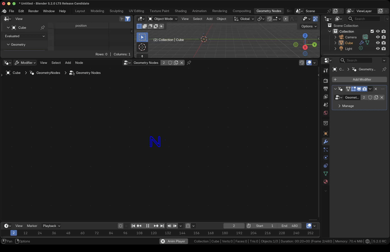

# Blender Node Tree Animation Builder 

This tool is for creating fancy node tree animation for blender node tree systems, you can use it to create 
animation for shader nodes, geometry nodes, compositor nodes, etc. It is a powerful tool that can help you 
create complex animation for your node tree explainary tutorials.

If you like the project, please give me a star! ⭐

## Features
- Supporting all node tree types, including **shader nodes**, **geometry nodes**, **compositor nodes**, **texture nodes**.
- Support for creating animation for **nodes**, **links**, **values**, **views** and even **annotations**.
- Live update animation parameters.
- Anim Curve editor for creating complex animation curves.

## Installation
- `Edit -> Preference -> Get Extensions -> Install from Disk...`, locate the zip file to install.

## Usage
Go to any `tree editor` space (Geometry Node Editor, Compositor, Shader Editor, Texture Node Editor), `N` panel to 
open the `Nodetree Anim` panel in the node worksapce to build the wanted animations.

| Node Anim Buildup | Link Anim Buildup | Value Anim Buildup | View Anim Buildup | Annotation Anim Buildup |
|---------|---------|---------|---------|---------|
|  |  |  |  |  |

You can animate `Nodes`, `Links`, `Values`, `Views` and `Annotations`. You can build the animations in `Bulk` for 
`Nodes`, `Links` and `Views` or one by one in `Manual` for `Nodes`, `Links` and `Values`. 
`Annotation` animation in its own category.
1. Bulk Build
    - The options above the list window are global controls, their value will control all items in the list.
        - The `Anim Start Frame` is an exceptional one, it only affects the first item's start value.
    - You can control individual behavior in the list.
2. Manual Build
    - First select a `Node` in the node list, 
        - Adjust desired controls to build the node's animation.
        - For `Link` and `Value`, the available links and values of the selected node will show up in the list, select one to build its animation.
        - You can also add a new `Link`.
2. Annotate
    - Add your annotation first, several quick tools, drawing, eraser, etc., are accessible for your convenience.
        - 🟢 Also support `Input texts` besides `Free drawing`
    - Once you have annotation, you can select and build the animation based on different levels, including `Layer`, `Frame` and `Stroke`.
    - A writing symbol can be added for writing effect animation.
    - You can `Restore Annotation` and start over your animation builds.
    - 🔴 Morph animation hasn't implemented yet.

  
Detailed description of settings

  <!-- Bulk Build part -->
  

    

    
Bulk Build

        

        The global adjustment will affect the each individual setting in the list, except the <code>Anim Start Frame</code> which only affects the first item's <code>Start Frame</code>.
         
        <b> Nodes </b>
        <ul>
          <li><code>Anim Start Frame</code> and <code>Start Frame</code>: The anim start frame.</li>
          <li><code>Anim Length</code>: The anim length in frames.</li>
          <li><code>Stagger Length</code>: The gap frames between previous and next item's animation.</li>
          <li><code>Sync Before Start</code>: Will sync the node's position to the <code>Start Position</code> before the anim starts.</li>
          <li><code>Start Position</code>: Set the node's <code>Fly In</code> anim starting position. The end position is always the position that before the anim creation.</li>
          <li><code>Path Multiplier</code>: Used for the path curve. Since the curve range is limited in Blender, you will need to multiply the point's y value in the curve by the <code>Path Multiplier</code> to get the actual position.</li>
          <li><code>Refresh Node List</code> and <code>Rebuild Node List</code>: Operator to refresh/rebuild the node list when you add/del nodes in the node tree.</li>
          <li><code>Node Anim Curve</code>: Control how the anim behaves.</li>
        </ul>
        The same settings for <code>Links</code> and <code>Views</code> will not be repeated again in the following.
         
        <b> Links </b>
        <ul>
              <li><code>Start Offset</code> and <code>End Offset</code>: I just estimate the links' position, when there are vector type links or previous socket is linked, the position is not accurate anymore, so you have to adjust the offset to match the connection position precisely.</li>
        </ul>
        <b> Views </b>
        <ul>
              <li><code>Move Size</code>: For the view <code>Follow</code> movement, how much the view will move, positive for the view to move right, negative for the view to move left.</li>
              <li><code>Zoom Size</code>: For the view <code>Zoom</code> movement, how much the view will zoom in/out, positive for the view to zoom in, negative for the view to zoom out.</li>
        </ul>
        

    

  

  <!-- Manual Build part -->
  

    

    
Manual Build

        

        It's for you to manually add one animation a time, select the item and the corresponding settings will show 
        up, adjust their values and build the animation. For <code>link</code> and <code>value</code>, the 
        available item list will show up when you select a node. You also can <code>add new link</code>.
         
        <b> Value </b>
        <ul>
          <li><code>Start Value</code> and <code>End Value</code>: The animated start and end range. </li>
          <li><code>Sync beginning value before start</code>: The value will sync to the start value for the time 
          prior to the anim starting time. </li>
        </ul>
        

    

  

  <!-- Annotate part -->
  

    

    
Annotate

        

        Beside the free draw, you can also input texts to build annotations. 
        <ul>
          <li><code>Annotation</code> is organized by <code>layers</code>, each <code>layer</code> can have 
          multiple <code>frames</code>, each <code>frame</code> contains multiple <code>strokes</code>. Properties 
          like <code>Opacity</code> and <code>Thickness</code> are layer level property, so you can only control 
          the annotations' apperance in layer level.</li>
          <li>When a stroke in a layer is animated, the layer will be locked and can't edit anymore. You can 
          <code>Restore Annotation</code> to edit the layer and rebuild the animation. It's better just add new 
          layers to add new annotations.</li>
          <li>You can add a writing symbol for the <code>Write On</code> or <code>Write Off</code> effect.</li>
        </ul>
        

    

  

Once the animation added, some controls will show up under their category, the controls are lively updating.

## To Do List
- **Annotation**
    - [ ] Implement Morph Anim
    - [x] Add Input text option for Annotation

## Tutorials
Check the detailed tutorial

